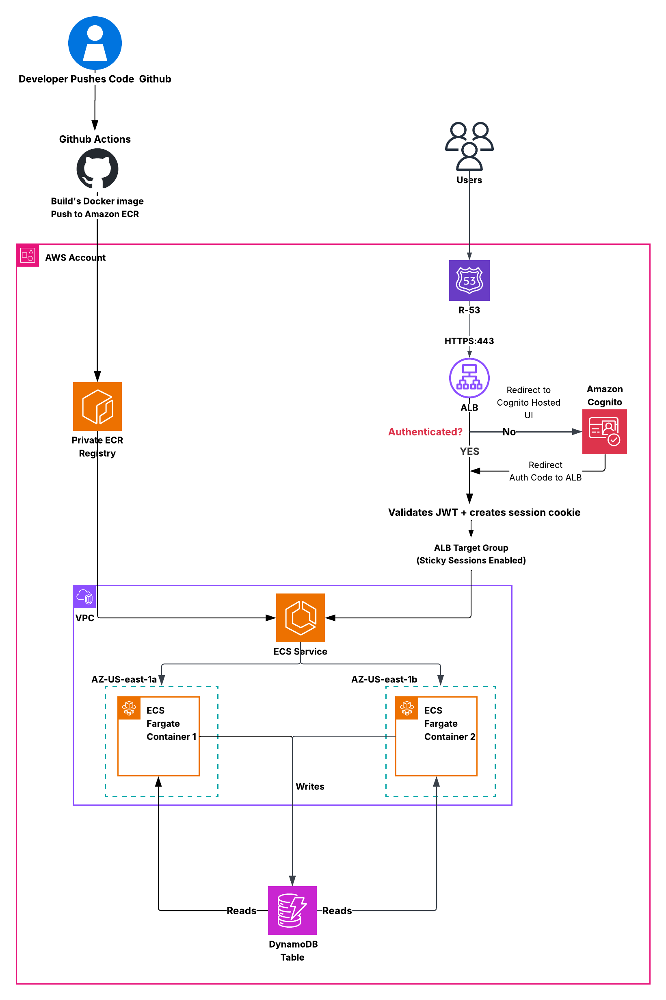

# Stateless Notes Application on AWS using ECS, ECR, ALB, Cognito, Route 53, DynamoDB, and GitHub Actions

## Architecture Diagram



## 1. Project Overview

This project demonstrates a stateless web application architecture on AWS using Amazon ECS with Fargate, Amazon ECR, Application Load Balancer, Amazon Cognito, Route 53, DynamoDB, and GitHub Actions.

The application is a Flask + Gunicorn based notes application. It is containerized with Docker, stored in Amazon ECR, and deployed through an ECS service running across multiple Availability Zones. User authentication is handled by Amazon Cognito through an Application Load Balancer listener rule. Application data is stored in DynamoDB so that all running containers can read and write shared data consistently.

This project was built to show the practical difference between stateful and stateless design:

- In a stateful design, data tied to individual instances creates inconsistent user experience behind a load balancer.
- In this stateless design, shared persistence through DynamoDB ensures consistent behavior regardless of which ECS task handles the request.

---

## 2. Architecture Summary

### 2.1 High-Level Flow

1. A developer pushes application code to GitHub.
2. GitHub Actions builds the Docker image.
3. GitHub Actions pushes the image to Amazon ECR.
4. Amazon ECS service pulls the image from ECR and deploys it using a rolling update strategy.
5. Users access the application through a custom Route 53 domain.
6. Route 53 resolves the domain to the Application Load Balancer.
7. The Application Load Balancer checks whether the user is authenticated.
8. If the user is not authenticated, the ALB redirects the user to Amazon Cognito Hosted UI.
9. After successful login, Cognito redirects the user back to the ALB using the OIDC authorization code flow.
10. The ALB validates the token and creates a session cookie.
11. The ALB forwards traffic to the target group.
12. The target group routes requests to healthy ECS tasks running in multiple Availability Zones.
13. All ECS tasks read and write shared application data to DynamoDB.

### 2.2 Architectural Behavior

This architecture is stateless because:

- Application containers do not store user notes locally.
- Notes are persisted in DynamoDB.
- Any healthy ECS task can serve the request.
- The user receives consistent data even when traffic is routed across multiple Availability Zones.

---

## 3. Architecture Visual

Use the architecture diagram in this repository to understand the final design.

### 3.1 Visual Flow Explanation

The diagram represents the following components and sequence:

1. **Developer and CI/CD Flow**
   - Developer pushes source code to GitHub.
   - GitHub Actions builds the Docker image.
   - GitHub Actions pushes the image to a private Amazon ECR repository.
   - ECS service uses the updated image during deployment.

2. **User Access Flow**
   - Users access the application through Route 53.
   - Route 53 sends traffic to the ALB over HTTPS on port 443.
   - The ALB checks whether the user is authenticated.
   - Unauthenticated users are redirected to Amazon Cognito Hosted UI.
   - Cognito returns the authorization code to the ALB.
   - The ALB validates the JWT and creates a session cookie.
   - The ALB forwards the request to the target group.

3. **Application Runtime Flow**
   - ECS service runs multiple Fargate tasks across `us-east-1a` and `us-east-1b`.
   - Traffic is routed to healthy tasks through the ALB target group.
   - Containers communicate with DynamoDB for persistent storage.
   - DynamoDB acts as the shared source of truth for all user notes.

### 3.2 Key Design Observation

Even though sticky sessions can be enabled at the target group, this application does not rely on instance-local or task-local state. Because persistence is externalized to DynamoDB, the application remains consistent across containers and Availability Zones.

---

## 4. Repository Structure

```text
STATE_LESS-ecsdemo/
├── .github/
│   └── workflows/
│       └── build.yml
├── static/
│   ├── css/
│   │   └── style.css
│   └── js/
│       └── app.js
├── templates/
│   └── index.html
├── app.py
├── Dockerfile
├── README.md
└── requirements.txt
```

### 4.1 File and Folder Purpose

1. **.github/workflows/build.yml**
   - GitHub Actions workflow file
   - Builds Docker image
   - Pushes image to Amazon ECR
   - Can be used for automated or manual deployment flows

2. **static/css/style.css**
   - Application styling
   - Controls UI presentation for the notes interface

3. **static/js/app.js**
   - Front-end client-side interactions
   - Supports UI actions such as clearing or resetting note editor state

4. **templates/index.html**
   - Main HTML template rendered by Flask
   - Displays authenticated user, instance metadata, notes, and note editor

5. **app.py**
   - Main Flask application
   - Handles routes, Cognito/ALB identity headers, DynamoDB operations, and UI rendering

6. **Dockerfile**
   - Defines container image build process for the Flask + Gunicorn application

7. **requirements.txt**
   - Python dependencies required by the application

8. **README.md**
   - Project documentation

---

## 5. Application Components

### 5.1 Flask Application

The Flask application provides the following core routes:

1. `/`
   - Displays the notes UI
   - Reads authenticated user details from ALB forwarded identity headers
   - Reads notes from DynamoDB

2. `/save`
   - Handles note creation and note update operations
   - Writes data to DynamoDB

3. `/logout`
   - Redirects the user to Cognito logout flow
   - Clears ALB authentication-related cookies

4. `/health`
   - Health check endpoint used by the target group

### 5.2 Gunicorn

Gunicorn is used as the production WSGI server for the Flask application inside the container.

### 5.3 Docker

The application is packaged as a Docker image so it can be:

- Built consistently
- Pushed to ECR
- Deployed through ECS service

---

## 6. DynamoDB Data Model

The application stores notes in a DynamoDB table.

### 6.1 Table Name

Example:

```text
user_notes
```

### 6.2 Recommended Schema

- Partition Key: `user_id`
- Sort Key: `note_id`

### 6.3 Why This Schema Was Used

1. `user_id`
   - Groups notes belonging to a single authenticated user

2. `note_id`
   - Uniquely identifies each note
   - Supports ordering and retrieval of individual notes

### 6.4 Benefit

This schema ensures that every ECS task reads and writes the same user data from shared storage.

---

## 7. Step-by-Step Implementation

### 7.1 Build the Application Code

1. Create `app.py`.
2. Add Flask routes for home, save, logout, and health.
3. Add logic to:
   - decode ALB/Cognito forwarded identity headers
   - identify authenticated user
   - read/write data from DynamoDB
4. Create `templates/index.html`.
5. Create `static/css/style.css`.
6. Create `static/js/app.js`.
7. Add Python dependencies to `requirements.txt`.

### 7.2 Containerize the Application

1. Create `Dockerfile`.
2. Use a Python base image.
3. Copy the application files into the image.
4. Install dependencies from `requirements.txt`.
5. Start the application with Gunicorn.

### 7.3 Store Container Images in Amazon ECR

1. Create a private ECR repository.
2. Configure GitHub Actions or local Docker login to ECR.
3. Push the built image to ECR.

### 7.4 Configure GitHub Actions for CI/CD

1. Create `.github/workflows/build.yml`.
2. Configure workflow steps to:
   - checkout source code
   - configure AWS credentials or IAM role/OIDC
   - login to ECR
   - build Docker image
   - push image to ECR
3. Use the workflow to support repeatable deployments.
4. Deploy ECS service updates using rolling update strategy.

### 7.5 Create the DynamoDB Table

1. Create a DynamoDB table.
2. Set:
   - Partition key: `user_id`
   - Sort key: `note_id`
3. Use on-demand capacity mode unless performance requirements justify provisioned mode.

### 7.6 Create the ECS Task Definition

1. Create an ECS task definition.
2. Define the container:
   - image from ECR
   - container port `5000`
3. Add environment variables, for example:
   - `DYNAMODB_TABLE`
   - `AWS_REGION`
   - `COGNITO_DOMAIN`
   - `COGNITO_CLIENT_ID`
   - `LOGOUT_REDIRECT_URI`
4. Attach IAM task role permissions required for DynamoDB access.
5. Attach ECS execution role for ECR image pull and logging.

### 7.7 Create the Target Group

1. Create an Application Load Balancer target group.
2. Use:
   - Target type: IP
   - Protocol: HTTP
   - Port: `5000`
3. Configure health check path:
   - `/health`
4. Verify healthy targets after ECS service starts.

### 7.8 Create the Application Load Balancer

1. Create an internet-facing ALB.
2. Select public subnets across at least two Availability Zones.
3. Configure security groups for inbound HTTPS traffic.
4. Add HTTPS listener on port `443`.
5. Attach ACM certificate for the custom domain.

### 7.9 Configure Amazon Cognito

1. Create or reuse a Cognito user pool.
2. Create an app client for this stateless application.
3. Configure callback URL:

```text
https://stateless.saithulluru.com/oauth2/idpresponse
```

4. Configure sign-out URL:

```text
https://stateless.saithulluru.com
```

5. Assign managed login style to the app client.
6. Configure the ALB HTTPS listener rule to:
   - authenticate user with Cognito
   - forward authenticated traffic to the target group

### 7.10 Create the ECS Service

1. Create ECS service using the task definition.
2. Choose Fargate launch type.
3. Set desired count to at least `2`.
4. Deploy tasks across multiple Availability Zones.
5. Attach the service to the target group.
6. Enable rolling deployment strategy.

### 7.11 Configure Route 53

1. Create an Alias A record in Route 53.
2. Point the custom domain to the ALB.

Example:

```text
stateless.saithulluru.com
```

### 7.12 Validate the Deployment

1. Open the Route 53 custom domain.
2. Verify redirection to Cognito for unauthenticated access.
3. Log in using Cognito Hosted UI.
4. Confirm the application loads successfully.
5. Save a note.
6. Refresh across requests and verify data consistency.
7. Confirm different ECS tasks can serve the same data from DynamoDB.

---

## 8. Runtime Request Flow

### 8.1 User Request Flow

1. User requests `https://stateless.saithulluru.com`.
2. Route 53 resolves the domain to the ALB.
3. ALB receives HTTPS request on port `443`.
4. ALB checks Cognito authentication.
5. If user is unauthenticated, ALB redirects to Cognito Hosted UI.
6. Cognito authenticates the user.
7. Cognito redirects back to ALB using authorization code flow.
8. ALB validates the token and creates a session cookie.
9. ALB forwards request to target group.
10. Target group routes traffic to a healthy ECS task on port `5000`.
11. ECS task reads and writes data from DynamoDB.
12. Response is returned to the user.

### 8.2 Deployment Flow

1. Developer pushes code to GitHub.
2. GitHub Actions builds the image.
3. Image is pushed to Amazon ECR.
4. ECS service uses the updated image.
5. Rolling deployment replaces tasks gradually without downtime.

---

## 9. Why This Project Is Stateless

This application is stateless because:

1. Application data is not stored in the local file system of the running container.
2. Data is externalized to DynamoDB.
3. Any ECS task can process user requests.
4. User experience remains consistent across tasks and Availability Zones.
5. Scaling the service does not create data inconsistency.

---

## 10. Comparison with Stateful Design

### 10.1 Stateful Version

In the earlier stateful version:

- Data was stored locally on EC2 instances.
- Requests routed to different instances could show different data.
- Sticky sessions improved behavior temporarily but did not solve the architectural limitation.

### 10.2 Stateless Version

In this version:

- Data is stored in DynamoDB.
- Requests can be served by any healthy ECS task.
- Application remains consistent even when traffic moves across Availability Zones.
- Architecture scales more reliably.

---

## 11. Validation Checklist

Use this checklist to verify the implementation:

1. Route 53 resolves to the ALB.
2. ALB listener uses HTTPS and Cognito authentication.
3. Cognito callback and sign-out URLs are configured correctly.
4. Target group health checks pass.
5. ECS service maintains healthy running tasks.
6. GitHub Actions builds and pushes image to ECR.
7. Rolling deployments update the ECS service correctly.
8. Notes remain consistent regardless of which ECS task handles the request.

---

## 12. Key Takeaways

1. Stateless design is critical for scalable distributed systems.
2. Shared storage such as DynamoDB removes dependency on task-local state.
3. ECS services provide better operational consistency than managing standalone containers manually.
4. GitHub Actions with ECR and ECS provides a clean CI/CD workflow.
5. Cognito integrated through ALB simplifies secure authentication for containerized applications.

---

## 13. Conclusion

This project demonstrates a complete stateless AWS application deployment pattern using:

- GitHub Actions for CI/CD
- Amazon ECR for container registry
- Amazon ECS with Fargate for runtime compute
- Application Load Balancer for secure traffic routing
- Amazon Cognito for authentication
- DynamoDB for shared persistent state
- Route 53 for DNS routing

It provides a practical reference for building scalable, secure, and production-aligned cloud-native applications on AWS.
